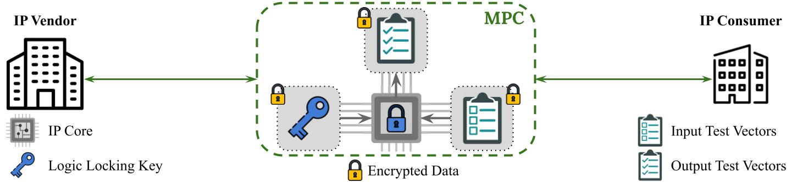

<h1 align="center">MPloC: Privacy-Preserving IP Verification using Logic Locking and Secure Multiparty Computation <a href="https://github.com/jimouris/mploc/blob/main/LICENSE"></a> </h1>

<p align="center">
    
</p>

## Overview
Combine logic locking with secure multiparty computation for privacy-preserving intellectual property verification.
Transform Verilog (2005) code (i.e., locked netlists) into ["Bristol Fashion"](https://homes.esat.kuleuven.be/~nsmart/MPC/) MPC Circuits and run them using [MP-SPDZ](https://github.com/data61/MP-SPDZ).


### How to cite this work
The SoK outlining this framework will appear in 2023 IEEE 29th International Symposium on On-Line Testing and Robust System Design [(IOLTS)](https://orion.polito.it/iolts/iolts2023) (the preprint can be accessed
[here](https://eprint.iacr.org/2023/511)) and [here](https://jimouris.github.io/publications/mouris2023mploc.pdf).
You can cite this article as follows:

```
@INPROCEEDINGS{IOLTS:Mouris23mploc,
  author    = "Dimitris Mouris and
               Charles Gouert and
               Nektarios Georgios Tsoutsos",
  booktitle =  "2023 IEEE 29th International Symposium on On-Line Testing 
                and Robust System Design (IOLTS)",
  title     =  "{MP$\ell\circ$C: Privacy-Preserving IP Verification using
                Logic Locking and Secure Multiparty Computation}",
  year      =  "2023",
  volume    =  "",
  number    =  "",
  pages     =  "1-7",
  doi       =  ""
}
```

## Install
### Prerequisites
```shell
sudo apt-get install automake build-essential clang cmake git libboost-dev \
    libboost-thread-dev libntl-dev libsodium-dev libssl-dev libtool m4 python3 \
    texinfo yasm yosys
```

Clone this repository:
```shell
git clone --recurse-submodules git@github.com:jimouris/mploc.git
```

### Build MP-SPDZ
```shell
cd MP-SPDZ
make setup
make Programs/Circuits
make -j8 all
cd ..
```

## Run

### Generate Bristol Circuit
Create the EDIF files with Yosys:
```shell
$ yosys
yosys> read_verilog Programs/Verilog/4_bit_adder.v
yosys> synth
yosys> abc -g XOR,AND
yosys> write_edif Programs/EDIF/4_bit_adder.edif
yosys> exit
```

Convert the edif file to a Bristol fashion circuit:
```shell
python src/edif2bristol.py --edif Programs/EDIF/4_bit_adder.edif --out Programs/Circuits/4_bit_adder.txt
```

### Prepare the Player Data
From the MP-SPDZ directory run:
```shell
mkdir -p Player-Data
echo 4 > Player-Data/Input-P0-0
echo 2 0 > Player-Data/Input-P1-0
```

```shell
./MP-SPDZ/compile.py 4_bit_adder
./MP-SPDZ/Scripts/semi.sh 4_bit_adder
```

<p align="center">
    
</p>
<h4 align="center">Trustworthy Computing Group</h4>
